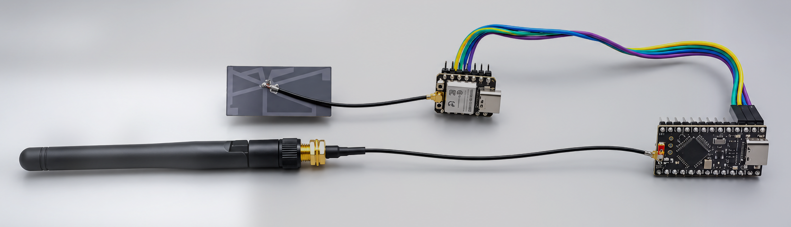
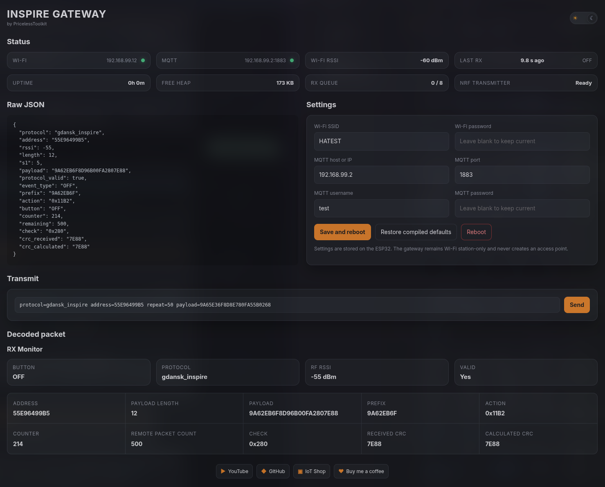
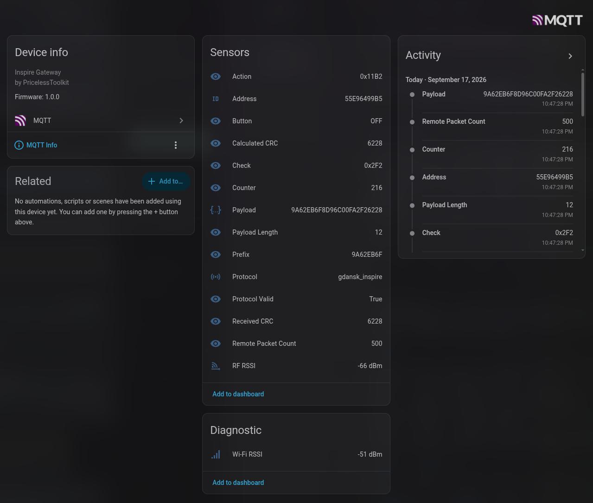
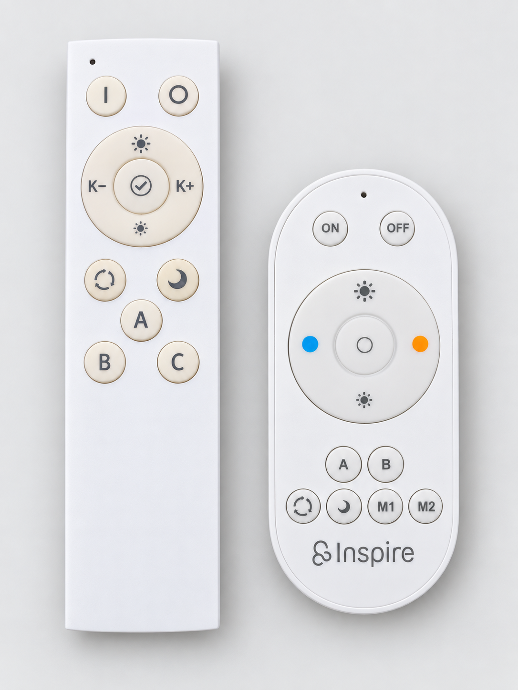
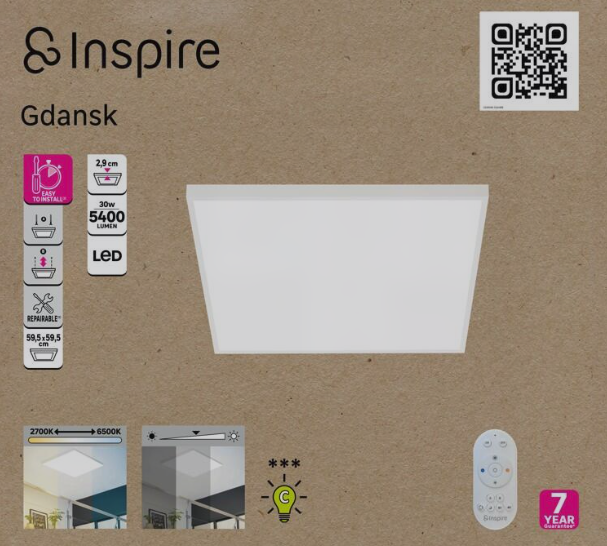
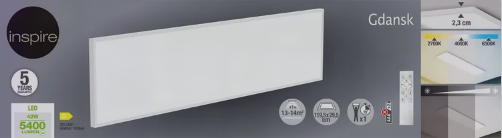

<div align="center">

  

🤗 Please consider subscribing to my YouTube channel. Your subscription goes a
long way toward supporting my work. If you would like to contribute even more,
you can also buy me a coffee.

[Shop](https://www.pricelesstoolkit.com) |
[YouTube](https://www.youtube.com/watch?v=mJt_VbMeRAU)

</div>

<p align="center">
  <a href="https://ko-fi.com/U6U2QLAF8">
    
  </a>
</p>

# Inspire Gateway

Inspire Gateway is an open-source RF-to-MQTT bridge that connects 2.4 GHz
Inspire ceiling lights and their handheld remotes to Home Assistant. It lets
you control the lights by publishing MQTT commands while also turning the
original remotes into general-purpose controllers for automations, scenes, and
other smart-home devices. I created this project because Inspire lights with
RF remotes cost roughly half as much as comparable Zigbee models, yet this
gateway gives them similar smart-home functionality. This repository is
intended for DIY enthusiasts who want to build or customize their own gateway.
In the future, I also plan to develop an RF module that brings the same
functionality to my [CapiBridge gateway](https://github.com/PricelessToolkit/CapiBridge).

## Interface preview

| Web interface | Home Assistant |
|:---:|:---:|
| [](img/webui.png) | [](img/HA.png) |

Click either screenshot to view it at full size.

## Tested lights

The gateway has been tested with the Inspire Gdansk ceiling lights and the
**2.4 GHz RF handheld remotes** pictured below.

<table>
  <tr>
    <th align="center">Tested 2.4 GHz RF handheld remotes</th>
    <th align="center">Tested Inspire Gdansk ceiling lights</th>
  </tr>
  <tr>
    <td align="center" valign="top">
      <a href="img/remote.png">
        
      </a>
    </td>
    <td align="center" valign="top">
      <a href="img/light1.png">
        
      </a><br>
      <strong>59.5 × 59.5 cm</strong><br><br>
      <a href="img/light2.png">
        
      </a><br>
      <strong>119.5 × 29.5 cm</strong>
    </td>
  </tr>
</table>

Click a photo to view it at full size.

## Features

- Receives the first packet of each physical remote-control burst.
- Publishes decoded RX data to MQTT as JSON.
- Creates one Home Assistant MQTT device automatically.
- Exposes the useful decoded RX fields as individual Home Assistant sensors.
- Reports the ESP32's Wi-Fi RSSI as a diagnostic sensor.
- Provides a responsive one-page web dashboard for status, RX monitoring,
  transmitting commands, and configuration.
- Replays known commands by publishing one JSON message to MQTT.
- Buffers up to eight RX messages while MQTT is disconnected.
- Supports protocol plugins without mixing RF-specific code into the gateway.

## Supported RF protocols

| Plugin | RF address | Command payload | Recommended repeats |
|---|---|---:|---:|
| `gdansk_inspire` | `55E96499B5` | Complete 12-byte packet | 150 |
| [`2ANO4-25W2R4G`](https://fccid.io/2ANO4-25W2R4G/Internal-Photos/Confidential-2ANO4-25W2R4G-Internal-Photos-3650716) | `4E22C32B40` | 8-byte known-action fingerprint or complete 188-byte body | 150 |

> [!NOTE]
> The longer remote shown above is visually the same as the remote documented
> under FCC ID `2ANO4-25W2R4G`. However, it was purchased about five years ago
> and its exact model number is no longer known, so this identification is based
> on its appearance and the decoded RF protocol rather than the original label.

The complete list of captured commands is in
[REMOTE_COMMANDS.md](REMOTE_COMMANDS.md). Detailed protocol notes are in
[gdansk_inspire.md](nRF52840/src/protocols/gdansk_inspire.md) and
[2ano4_25w2r4g.md](nRF52840/src/protocols/2ano4_25w2r4g.md).

> [!TIP]
> Want to add support for another remote or RF device? The
> [Agentic RF Reverse-Engineering Guide](AI_AGENT_RF_REVERSE_ENGINEERING_GUIDE.md)
> documents the HackRF-based, AI-assisted workflow I used to capture and analyze
> unknown 2.4 GHz signals, identify their protocol, and turn the results into a
> new gateway protocol plugin.

## Required Hardware

- [Seeed Studio XIAO ESP32-C3 - Aliexpress Link](https://s.click.aliexpress.com/e/_c2wn9qFF)
- [Nice!Nano/Pro Micro nRF52840 - Aliexpress Link](https://s.click.aliexpress.com/e/_c4ndoKkH)
- [3 x jumper wires Female/Female - Aliexpress Link](https://s.click.aliexpress.com/e/_c4oNRSyl)
- External 2.4 GHz antenna for the nRF52840 (recommended for better range)
- 2 x USB Cable

> [!TIP]
> I added an external 2.4 GHz antenna to the nRF52840 board to improve its
> range. With this antenna, the gateway can control every tested light throughout
> my 80 m² apartment, including through concrete walls. The nRF52840 has a
> maximum transmit power of only **+8 dBm**, and this firmware already selects
> that maximum for both supported protocols. Because the output cannot be raised
> further in software, improving the antenna is the practical way to increase
> range without adding an external RF power amplifier. See the official
> [Nordic nRF52840 product specification](https://docs.nordicsemi.com/r/bundle/ps_nrf52840/page/keyfeatures_html5.html).

### Wiring

| XIAO ESP32-C3 | Direction | nRF52840 |
|---|---:|---|
| D9 / GPIO9 TX | → | P0.06 RX (D3 header position) |
| D10 / GPIO10 RX | ← | P0.08 TX (D2 header position) |
| GND | ↔ | GND |

The inter-board UART runs at **921600 baud, 8N1**.
The ESP32 firmware uses GPIO9 for TX and GPIO10 for RX. The nRF52840 firmware
is compiled with the Adafruit Feather nRF52840 variant, where Arduino pin 11
maps to physical P0.06 and Arduino pin 12 maps to physical P0.08.

## Configuration

Edit [esp32/config.h](esp32/config.h) before compiling the ESP32 firmware:

```cpp
constexpr char WIFI_SSID[] = "YOUR_WIFI_NAME";
constexpr char WIFI_PASSWORD[] = "YOUR_WIFI_PASSWORD";

constexpr char MQTT_HOST[] = "192.168.1.10";
constexpr uint16_t MQTT_PORT = 1883;
constexpr char MQTT_USERNAME[] = "YOUR_MQTT_USER";
constexpr char MQTT_PASSWORD[] = "YOUR_MQTT_PASSWORD";

constexpr char WEB_USERNAME[] = "admin";
constexpr char WEB_PASSWORD[] = "inspire-gateway";
```

These compiled settings are also the defaults restored by the web interface.
After the gateway is connected, Wi-Fi and MQTT settings can be changed from
the browser and are saved in ESP32 non-volatile storage.

The default MQTT topics are:

| Purpose | Topic | Retained |
|---|---|---:|
| Send an RF command | `inspire-gateway/tx` | **No** |
| Receive decoded RF data | `inspire-gateway/rx` | No |
| ESP32 Wi-Fi signal | `inspire-gateway/rssi` | Yes |
| Gateway availability | `inspire-gateway/availability` | Yes |
| Home Assistant discovery | `homeassistant/device/inspire-gateway/config` | Yes |

## Web interface

Open the IP address printed by the ESP32 in a browser, for example
`http://192.168.1.50/`.
The default sign-in is configured in [esp32/config.h](esp32/config.h):

```text
Username: admin
Password: inspire-gateway
```

The responsive one-page dashboard provides:

- Wi-Fi, MQTT, uptime, memory, RX queue, and nRF transmitter status
- A live view of every decoded field from the latest received packet
- Manual protocol/address/repeat/payload command-line transmission
- Persistent Wi-Fi and MQTT configuration, reboot, and restore-default controls
- Dark and light themes stored locally in the browser

The web interface uses the existing Wi-Fi connection only. It does not create
an access point or captive portal. Password values are never returned by its
settings API; leaving a password box empty keeps the currently stored value.

## Home Assistant

MQTT discovery is enabled by default. After the ESP32 connects, Home Assistant
creates one device named **Inspire-Gateway**.

The normal Sensors section contains:

- Action
- Address
- Button
- Check
- Counter
- Calculated CRC
- Received CRC
- Payload Length
- Payload
- Prefix
- Protocol
- Protocol Valid
- Remote Packet Count
- RF RSSI

The Diagnostic section contains **Wi-Fi RSSI**, which is sampled directly from
the ESP32 every 30 seconds. `RF RSSI` is different: it is the nRF receiver's
signal measurement for the most recently received RF packet.

RX messages are deliberately not retained. After Home Assistant or its MQTT
integration restarts, RX values may remain unknown until the next remote button
press.

## Sending a payload from Home Assistant

Publish a JSON object to `inspire-gateway/tx`. The TX message must **not** be
retained.

Use **Developer Tools → Actions**, select `mqtt.publish`, and provide:

```yaml
topic: inspire-gateway/tx
payload: >-
  {"protocol":"gdansk_inspire","address":"55E96499B5","repeat":200,"payload":"9A62EB6F8D8DA80FA1827D58"}
retain: false
```

That example turns the first-profile light on. To turn it off, use the same
Home Assistant action with this payload:

```yaml
topic: inspire-gateway/tx
payload: >-
  {"protocol":"gdansk_inspire","address":"55E96499B5","repeat":200,"payload":"9A62EB6F8D95B00FA181D528"}
retain: false
```

The same action can be used in a Home Assistant script or automation:

```yaml
sequence:
  - action: mqtt.publish
    data:
      topic: inspire-gateway/tx
      payload: >-
        {"protocol":"gdansk_inspire","address":"55E96499B5","repeat":200,"payload":"9A62EB6F8D8DA80FA1827D58"}
      retain: false
```

### TX JSON fields

| Field | Meaning |
|---|---|
| `protocol` | Registered nRF plugin name |
| `address` | Five-byte RF address represented by exactly 10 hexadecimal characters |
| `repeat` | Number of RF transmissions; must be within the selected plugin's limit |
| `payload` | Protocol-specific, even-length hexadecimal payload |

For `gdansk_inspire`, send the complete captured 12-byte payload, including its
CRC. The CRC includes the RF address, so changing `address` without generating
a matching payload will not work.

For `2ANO4-25W2R4G`, a known 8-byte fingerprint is expanded by the nRF plugin
into its captured 188-byte radio frame. Example Home Assistant ON action data:

```yaml
topic: inspire-gateway/tx
payload: >-
  {"protocol":"2ANO4-25W2R4G","address":"4E22C32B40","repeat":150,"payload":"38103B2650AB2B39"}
retain: false
```

Allow about 790 ms between the shown 200-repeat `gdansk_inspire` commands and
about 525 ms between 150-repeat `2ANO4-25W2R4G` commands.

## Receiving and copying a payload

The discovered Home Assistant sensors show the decoded fields from each remote
press. The underlying message on `inspire-gateway/rx` contains JSON similar to:

```json
{
  "protocol": "gdansk_inspire",
  "address": "55E96499B5",
  "rssi": -52,
  "length": 12,
  "s1": 5,
  "payload": "9A62EB6F8D8DA80FA1827D58",
  "protocol_valid": true,
  "event_type": "ON",
  "prefix": "9A62EB6F",
  "action": "0x11B1",
  "button": "ON",
  "counter": 181,
  "remaining": 500,
  "check": "0x182",
  "crc_received": "7D58",
  "crc_calculated": "7D58"
}
```

To replay a captured `gdansk_inspire` command, copy `protocol`, `address`, and
the complete `payload` into a TX JSON object and add a suitable `repeat` value:

```json
{
  "protocol": "gdansk_inspire",
  "address": "55E96499B5",
  "repeat": 50,
  "payload": "9A62EB6F8D8DA80FA1827D58"
}
```

The nRF forwards the first complete packet of a physical burst to the ESP32.
The remaining duplicate packets are suppressed on the hardware UART. The nRF's
red LED remains illuminated during the complete RF burst because every received
duplicate extends its LED timeout; this does not mean MQTT publication is
delayed.

## USB diagnostics

The ESP32 USB serial port runs at **115200 baud**. While a terminal is connected,
successful and queued MQTT RX operations are logged with an ESP32 millisecond
timestamp:

```text
MQTT RX published at 12345 ms: {"protocol":"gdansk_inspire",...}
MQTT RX queued at 12345 ms: {"protocol":"gdansk_inspire",...}
MQTT queued RX published at 12890 ms: {"protocol":"gdansk_inspire",...}
```

USB logging is skipped entirely when no terminal is connected, so a closed
serial monitor cannot delay MQTT publication.

The nRF52840 USB serial port runs at **921600 baud** and mirrors RF reception.
Its `DUMP_RX`, `DUMP_RX_ALL`, and `DUMP_RX_STOP` commands are documented in
[nRF52840/README.md](nRF52840/README.md).

## Building and flashing

### ESP32-C3

Requirements:

- ESP32 Arduino core 3.3.11
- ArduinoJson 7.x
- PubSubClient 2.8

```sh
arduino-cli compile --fqbn esp32:esp32:XIAO_ESP32C3 esp32
arduino-cli upload \
  --fqbn esp32:esp32:XIAO_ESP32C3 \
  --port /dev/ttyACM0 \
  esp32
```

If upload mode is not entered automatically, hold **BOOT**, press and release
**RESET**, and then release **BOOT** before retrying.

### nRF52840

The current generic nRF52840 board is built using Adafruit's Feather nRF52840
variant:

```sh
arduino-cli compile --fqbn adafruit:nrf52:feather52840 nRF52840
arduino-cli upload \
  --fqbn adafruit:nrf52:feather52840 \
  --port /dev/ttyACM0 \
  nRF52840
```

Board-specific implementation details are documented in
[esp32/README.md](esp32/README.md) and [nRF52840/README.md](nRF52840/README.md).

## Project structure

```text
esp32/                  Wi-Fi, MQTT, Home Assistant, and decoder firmware
nRF52840/               RF modem and protocol plugins
REMOTE_COMMANDS.md      Known commands for all captured remotes
AI_AGENT_RF_REVERSE_ENGINEERING_GUIDE.md
                        Capture and protocol-development workflow
```

## Important limitations

> [!IMPORTANT]
> - Only one RF protocol is active for reception at a time. A successful TX
>   command selects that protocol until another TX command changes it.
> - Unknown remotes may use a different RF address, profile, CRC, pairing value,
>   or complete long frame. Capture and validate them before transmitting.
> - RF transmission must comply with the laws and band rules applicable in your
>   location. Use the gateway only with devices you are authorized to control.
